# Portfolio v2 — Implementation Plan

Replace the current Vite site at **https://castiarena.github.io** (repo [`castiarena/castiarena.github.io`](https://github.com/castiarena/castiarena.github.io)) with a Next.js portfolio built by a team of AI agents working in parallel.

The site has three sections:

| Section | Route | What it shows |
|---|---|---|
| **Bio** | `/bio/` | Your experience, based on your CV: summary, timeline, achievements, skills, training, CV download |
| **Experiments** | `/experiments/` | Links to your smaller web experiments, with tags and previews |
| **Projects** | `/projects/` + `/projects/[slug]/` | Bigger projects with a description, your role, the stack, results and links |

There is also a home page (`/`) that points to all three, and a contact dialog you can open from any page.

---

## Stack (decided)

| Layer | Choice | Why |
|---|---|---|
| Framework | **Next.js 16.x (App Router) + React 19.2**, `output: 'export'` | You asked for Next. A static export runs on GitHub Pages, and Vercel serves the same build for previews |
| Language | TypeScript (strict) | Typed content keeps parallel agents in sync |
| Styling | **Tailwind CSS v4** (CSS-first `@theme`, OKLCH tokens) | Fast builds, cascade layers, bright gradients |
| UI | **shadcn/ui** (Tailwind v4 flavour) | Navigation menu, sheet, dialog, form, badge, card |
| Motion | **Motion** (`motion/react`, formerly Framer Motion) | Reveal on scroll, stagger, hover effects. Respects `prefers-reduced-motion`. GSAP stays out unless a later task needs a pinned timeline |
| Package manager | pnpm (via `corepack`) · Node 24 LTS | |
| Tests | Vitest + Testing Library · Playwright · axe · Lighthouse CI | |
| Hosting | **GitHub Pages** (production) · **Vercel** (a preview for every PR, plus staging) | See [03-deployment-flow.md](./03-deployment-flow.md) |

> Vite + React 19 was the alternative. It was dropped because you asked for Next, and Next gives per-route HTML plus metadata, sitemap and OG images at build time with no extra tooling.

---

## How to read this plan

| # | File | Purpose |
|---|---|---|
| 00 | `00-README.md` | This file: overview, waves, how to run the agents |
| 01 | [`01-architecture.md`](./01-architecture.md) | Folder structure, routes, rendering rules, design direction |
| 02 | [`02-shared-contracts.md`](./02-shared-contracts.md) | Types, stubs and **file ownership**. This is what lets agents run in parallel without conflicts |
| 03 | [`03-deployment-flow.md`](./03-deployment-flow.md) | GitHub → Vercel previews → GitHub Pages production, branches, workflows, cutover, rollback |
| 04 | [`04-agent-loop-protocol.md`](./04-agent-loop-protocol.md) | The loop every agent follows: branch → build → verify → hand off → PR |
| 05 | [`05-inputs-needed.md`](./05-inputs-needed.md) | Things only **you** can provide (project list, experiments, accounts) |
| — | [`assets/`](./assets) | `cv-content.md` (the CV as text), `profile.jpg` (taken from the CV), `agustin-castiarena-resume.pdf` |
| — | [`prompts/`](./prompts) | One prompt file per agent, grouped by wave |

---

## The design build (read this first)

The design was approved after this plan was written: 11 screens in `design-build/reference/portfolio-design.pdf`. **[`design-build/`](./design-build/00-README.md) is now the authoritative source for everything visual** and replaces the UI prompts below:

| Replaced | By |
|---|---|
| `1.1 Design system` | `design-build` F1 (tokens) + F2 (primitives & shared) |
| `1.3 Motion primitives` | `design-build` F3 (motion) |
| `2.1` – `2.6` (all of wave 2) | `design-build` U1 – U6, plus V1 (visual QA & polish) |

Everything else here still stands: 0.1 bootstrap, 1.2 content, 1.4 CI/CD, and waves 3 and 4 run unchanged (wave 3 starts after V1).

## Execution waves

Agents in the same wave **run in parallel**. A wave starts only after every PR from the previous wave is merged into `next`.

```mermaid
flowchart LR
  subgraph W0["Wave 0 · sequential"]
    A01["0.1 Bootstrap repo<br/>scaffold + contracts + stubs"]
  end
  subgraph W1["Wave 1 · 4 agents in parallel"]
    A11["1.1 Design system"]
    A12["1.2 Content data"]
    A13["1.3 Motion primitives"]
    A14["1.4 CI/CD pipelines"]
  end
  subgraph W2["Wave 2 · 6 agents in parallel"]
    A21["2.1 Layout shell"]
    A22["2.2 Home"]
    A23["2.3 Bio"]
    A24["2.4 Experiments"]
    A25["2.5 Projects"]
    A26["2.6 Contact"]
  end
  subgraph W3["Wave 3 · 3 agents in parallel"]
    A31["3.1 SEO & metadata"]
    A32["3.2 Quality: e2e, a11y, perf"]
    A33["3.3 Deploy dry-run"]
  end
  subgraph W4["Wave 4 · sequential + human"]
    A41["4.1 Cutover to production"]
    A42["4.2 Post-launch check"]
  end
  W0 --> W1 --> W2 --> W3 --> W4
```



| Wave | Prompt file | Agent | Runs | Depends on |
|---|---|---|---|---|
| 0 | [`prompts/wave-0/0.1-bootstrap-repo.md`](./prompts/wave-0/0.1-bootstrap-repo.md) | Bootstrap | alone | — |
| 1 | [`prompts/wave-1/1.1-design-system.md`](./prompts/wave-1/1.1-design-system.md) | Design system | parallel | 0.1 |
| 1 | [`prompts/wave-1/1.2-content-data.md`](./prompts/wave-1/1.2-content-data.md) | Content data | parallel | 0.1 |
| 1 | [`prompts/wave-1/1.3-motion-primitives.md`](./prompts/wave-1/1.3-motion-primitives.md) | Motion | parallel | 0.1 |
| 1 | [`prompts/wave-1/1.4-ci-cd-pipelines.md`](./prompts/wave-1/1.4-ci-cd-pipelines.md) | CI/CD | parallel | 0.1 |
| 2 | [`prompts/wave-2/2.1-layout-shell.md`](./prompts/wave-2/2.1-layout-shell.md) | Layout shell | parallel | wave 1 |
| 2 | [`prompts/wave-2/2.2-home-page.md`](./prompts/wave-2/2.2-home-page.md) | Home | parallel | wave 1 |
| 2 | [`prompts/wave-2/2.3-bio-page.md`](./prompts/wave-2/2.3-bio-page.md) | Bio | parallel | wave 1 |
| 2 | [`prompts/wave-2/2.4-experiments-page.md`](./prompts/wave-2/2.4-experiments-page.md) | Experiments | parallel | wave 1 |
| 2 | [`prompts/wave-2/2.5-projects-pages.md`](./prompts/wave-2/2.5-projects-pages.md) | Projects | parallel | wave 1 |
| 2 | [`prompts/wave-2/2.6-contact.md`](./prompts/wave-2/2.6-contact.md) | Contact | parallel | wave 1 |
| 3 | [`prompts/wave-3/3.1-seo-metadata.md`](./prompts/wave-3/3.1-seo-metadata.md) | SEO | parallel | wave 2 |
| 3 | [`prompts/wave-3/3.2-quality-e2e-a11y-perf.md`](./prompts/wave-3/3.2-quality-e2e-a11y-perf.md) | Quality | parallel | wave 2 |
| 3 | [`prompts/wave-3/3.3-deploy-dry-run.md`](./prompts/wave-3/3.3-deploy-dry-run.md) | Deploy dry-run | parallel | wave 2 |
| 4 | [`prompts/wave-4/4.1-cutover-production.md`](./prompts/wave-4/4.1-cutover-production.md) | Release | alone + you | wave 3 |
| 4 | [`prompts/wave-4/4.2-post-launch-verification.md`](./prompts/wave-4/4.2-post-launch-verification.md) | Verify | alone | 4.1 |

In total that is **16 agents in 5 waves**. The widest point is 6 agents at once (wave 2).

---

## Running the agents

Each agent works in its **own git worktree and branch** so parallel agents never share a working copy.

```bash
# one-time: clone and create the integration branch (Wave 0 agent does this)
git clone git@github.com:castiarena/castiarena.github.io.git portfolio-v2 && cd portfolio-v2

# per agent in a wave (example: wave 1)
for id in 1.1-design-system 1.2-content-data 1.3-motion-primitives 1.4-ci-cd-pipelines; do
  git worktree add "../wt-$id" -b "agent/$id" origin/next
done

# launch each agent in its worktree with its prompt (any agent runner works; Claude Code shown)
( cd ../wt-1.1-design-system  && claude -p "$(cat docs/plan/prompts/wave-1/1.1-design-system.md)" ) &
( cd ../wt-1.2-content-data   && claude -p "$(cat docs/plan/prompts/wave-1/1.2-content-data.md)" ) &
( cd ../wt-1.3-motion-primitives && claude -p "$(cat docs/plan/prompts/wave-1/1.3-motion-primitives.md)" ) &
( cd ../wt-1.4-ci-cd-pipelines && claude -p "$(cat docs/plan/prompts/wave-1/1.4-ci-cd-pipelines.md)" ) &
wait
```

Every prompt file is self-contained: **the whole file is the prompt** (mission, context to load, owned paths, tasks, acceptance criteria, loop rules). The Wave 0 agent copies this `docs/plan/` folder into the repo at `docs/plan/`, so every later agent can read it. For Wave 0 itself, run the agent from this `portfolio/` folder so it can find `docs/plan/`.

### Gate between waves (you or an orchestrator agent)

1. All PRs for the wave are open, CI is green, and each has a Vercel preview URL.
2. Look through the previews and merge the PRs into `next`. Merge order within a wave does not matter (see the lockfile rule in 04).
3. Check that `next` is green after the last merge, then start the next wave from the updated `origin/next`.

---

## Definition of done (whole project)

- [ ] `https://castiarena.github.io/` serves the new Next.js site from `main`, deployed by GitHub Actions
- [ ] Every PR gets a Vercel preview, and `next` has a stable staging URL
- [ ] `/`, `/bio/`, `/experiments/`, `/projects/`, and every `/projects/[slug]/` render with no JS errors
- [ ] Lighthouse (mobile): Performance ≥ 90, Accessibility ≥ 95, Best Practices ≥ 95, SEO ≥ 95
- [ ] axe finds no serious or critical violations, and animations respect `prefers-reduced-motion`
- [ ] The old site is kept on the `legacy-v1` tag and branch, and there is a written rollback procedure
