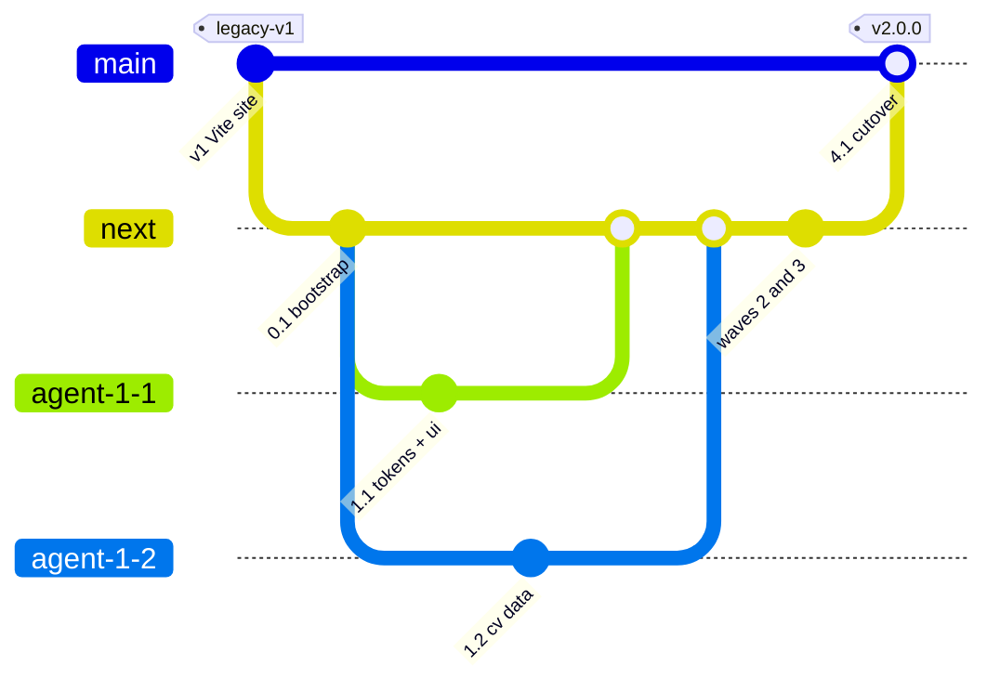
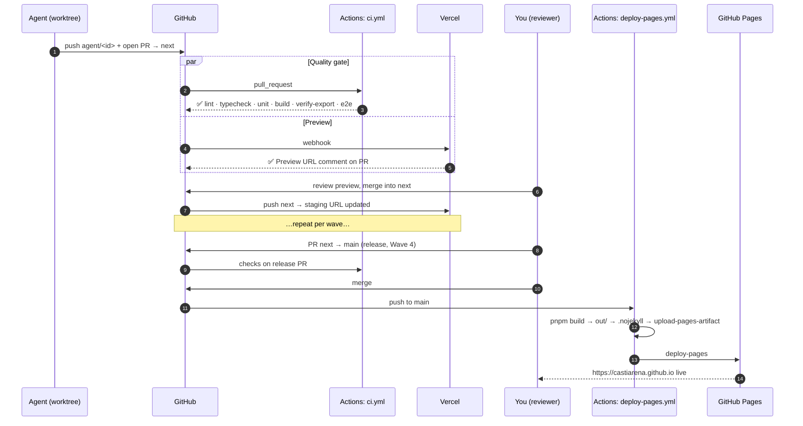

# 03 — Deployment Flow: GitHub → Vercel → GitHub Pages

## 1. Roles of each platform

| Platform | Role | Triggered by | URL |
|---|---|---|---|
| **GitHub** | Source of truth: code review, required checks, Actions | every push/PR | `github.com/castiarena/castiarena.github.io` |
| **GitHub Actions: `ci.yml`** | Quality gate: lint, typecheck, unit, build, export check, e2e | PRs to `next`/`main`, pushes to `next`/`main` | — |
| **Vercel** (Git integration) | **Preview** deploy for every PR and a **staging** URL for `next`. Production on Vercel is **turned off** | PR opened/updated, push to `next` | `*-git-<branch>-castiarena.vercel.app` |
| **GitHub Actions: `deploy-pages.yml`** | **Production** deploy of the static export | push to `main`, manual `workflow_dispatch` | **`https://castiarena.github.io`** |

Vercel and GitHub Pages serve **the same `next build` output** (`output: 'export'`, no `basePath`). What passes on the Vercel preview is exactly what ships to Pages.

> **Why not just Vercel?** You want the canonical site to stay at `castiarena.github.io`. Vercel can't serve that domain, so it is used where it is strongest: instant previews on PRs, with preview comments and share links. Vercel's non-production deployments send `X-Robots-Tag: noindex` by default, so previews won't compete with the real site in search.

---

## 2. Branch model


*(Agent branches are really named `agent/<id>-<slug>`; they are shortened in the diagram. `legacy-v1` is also kept as a branch at the tagged commit.)*

| Branch | Purpose | Protected | Deploys to |
|---|---|---|---|
| `main` | Production. Today it holds the Vite site; after cutover it holds Next | ✅ requires PR + `ci` + 1 review (you) | GitHub Pages |
| `legacy-v1` (branch + tag) | Frozen copy of the current Vite site, used for rollback | ✅ read-only | — |
| `next` | Integration branch for all waves | ✅ requires PR + `ci` + Vercel check | Vercel staging (branch URL) |
| `agent/<id>-<slug>` | One per agent | — | Vercel preview (PR) |

---

## 3. End-to-end flow



---

## 4. Reference workflows (agent 1.4 implements these; check the latest action majors when implementing)

### `.github/workflows/ci.yml`

```yaml
name: ci
on:
  pull_request:
    branches: [next, main]
  push:
    branches: [next, main]
concurrency:
  group: ci-${{ github.ref }}
  cancel-in-progress: true
permissions:
  contents: read
jobs:
  verify:
    runs-on: ubuntu-latest
    timeout-minutes: 15
    steps:
      - uses: actions/checkout@v5
      - uses: pnpm/action-setup@v4
      - uses: actions/setup-node@v5
        with:
          node-version-file: .nvmrc
          cache: pnpm
      - run: pnpm install --frozen-lockfile
      - run: pnpm lint
      - run: pnpm typecheck
      - run: pnpm test -- --run
      - run: pnpm build
        env:
          NEXT_PUBLIC_SITE_URL: https://castiarena.github.io
      - run: node scripts/verify-export.mjs
      - uses: actions/upload-artifact@v4
        with:
          name: out
          path: out
          retention-days: 3

  e2e:
    needs: verify
    runs-on: ubuntu-latest
    timeout-minutes: 15
    steps:
      - uses: actions/checkout@v5
      - uses: pnpm/action-setup@v4
      - uses: actions/setup-node@v5
        with:
          node-version-file: .nvmrc
          cache: pnpm
      - run: pnpm install --frozen-lockfile
      - uses: actions/download-artifact@v4
        with:
          name: out
          path: out
      - run: pnpm exec playwright install --with-deps chromium
      - run: pnpm e2e
        env:
          E2E_SKIP_BUILD: '1'   # playwright webServer serves ./out only
      - if: failure()
        uses: actions/upload-artifact@v4
        with:
          name: playwright-report
          path: playwright-report
```

### `.github/workflows/deploy-pages.yml`

```yaml
name: deploy-pages
on:
  push:
    branches: [main]
  workflow_dispatch:
    inputs:
      ref:
        description: 'Git ref to deploy (for rollback), default = main'
        required: false
permissions:
  contents: read
  pages: write
  id-token: write
concurrency:
  group: pages
  cancel-in-progress: false
jobs:
  build:
    runs-on: ubuntu-latest
    steps:
      - uses: actions/checkout@v5
        with:
          ref: ${{ inputs.ref || github.ref }}
      - uses: pnpm/action-setup@v4
      - uses: actions/setup-node@v5
        with:
          node-version-file: .nvmrc
          cache: pnpm
      - run: pnpm install --frozen-lockfile
      - run: pnpm build
        env:
          NEXT_PUBLIC_SITE_URL: https://castiarena.github.io
          NEXT_PUBLIC_DEPLOY_ENV: production
          NEXT_PUBLIC_FORM_ENDPOINT: ${{ vars.NEXT_PUBLIC_FORM_ENDPOINT }}
      - run: touch out/.nojekyll && node scripts/verify-export.mjs
      - uses: actions/upload-pages-artifact@v4
        with:
          path: out
  deploy:
    needs: build
    runs-on: ubuntu-latest
    environment:
      name: github-pages
      url: ${{ steps.deployment.outputs.page_url }}
    steps:
      - id: deployment
        uses: actions/deploy-pages@v4
```

> We do **not** use `actions/configure-pages` with `static_site_generator: next`. It rewrites `next.config.js` to inject a `basePath`, which a user site doesn't need, and it doesn't handle `next.config.ts`. The config is committed explicitly instead.

### `scripts/verify-export.mjs` (checks the build output)

It fails the job unless `out/` contains `index.html`, `404.html`, `bio/index.html`, `experiments/index.html`, `projects/index.html`, one `projects/<slug>/index.html` per slug, `sitemap.xml`, `robots.txt` (from Wave 3 onward; before that a warning), `_next/static/`, and `cv/agustin-castiarena-resume.pdf`. It also checks that no HTML file references `/_next/` under a `basePath`.

### `vercel.json`

```json
{
  "$schema": "https://openapi.vercel.sh/vercel.json",
  "framework": "nextjs",
  "installCommand": "pnpm install --frozen-lockfile",
  "buildCommand": "pnpm build",
  "git": {
    "deploymentEnabled": {
      "main": false,
      "legacy-v1": false
    }
  }
}
```

---

## 5. One-time setup checklist (you do this; agents can't)

**GitHub**

- [ ] Settings → Branches: protect `main` and `next` (require PR, require status checks `ci / verify`, `ci / e2e`, and `Vercel` on `next`).
- [ ] Settings → Environments → `github-pages`: deployment branches = `main` only.
- [ ] Settings → Actions → General: *Workflow permissions* = read, and allow Actions to create PRs = off.
- [ ] (Optional) Settings → Variables → `NEXT_PUBLIC_FORM_ENDPOINT` = your Formspree/Web3Forms endpoint.
- [ ] **Do not change Pages yet.** The source switch happens during cutover (§6).

**Vercel**

- [ ] vercel.com → *Add New Project* → import `castiarena/castiarena.github.io` (install the Vercel GitHub App on that repo only).
- [ ] Framework: Next.js · Root: `./` · Node.js 24.x.
- [ ] Settings → Git → *Production Branch* = `main`. It is turned off by `vercel.json`, so Vercel only builds previews and `next`.
- [ ] Environment variables (Preview): `NEXT_PUBLIC_SITE_URL` = leave empty (falls back to github.io for canonical links), `NEXT_PUBLIC_FORM_ENDPOINT` = same as GitHub.
- [ ] Settings → Deployment Protection: keep *Vercel Authentication* on for previews if you want them private, or turn it off to share previews publicly.
- [ ] Before Wave 1, check that a test PR gets a Vercel preview comment.

---

## 6. Cutover procedure (Wave 4)

1. **Confirm legacy is frozen**: agent 0.1 created the `legacy-v1` tag and branch from `main`. Check that `git rev-parse legacy-v1` equals the tip of `origin/main` (if `main` got new commits since, move both to the new tip).
2. **Release PR**: `next → main`, titled `release: v2.0.0`. Wait for CI and do a final review on the `next` staging URL.
3. **Switch the Pages source**: Settings → Pages → *Build and deployment* → Source: **GitHub Actions**. The old deployment keeps being served until a new one replaces it. Do this right before step 4.
4. **Merge** the release PR. `deploy-pages.yml` runs, takes about 2–3 minutes, and the environment `github-pages` shows the URL.
5. **Verify**: agent 4.2 runs the post-launch checks against `https://castiarena.github.io`.
6. Tag `v2.0.0` on `main`.

## 7. Rollback

| Situation | Action | Time to recover |
|---|---|---|
| A bad v2 deploy (a later commit broke something) | Actions → `deploy-pages` → *Run workflow* with `ref` = last good SHA or tag | ~3 min |
| A bad commit on `main` | `git revert` via PR → merge → auto deploy | ~5 min |
| v2 has to be pulled completely | Settings → Pages → Source: *Deploy from a branch* → `legacy-v1` / the folder the Vite site used before (check the current setting in step 1 and note it in `docs/DEPLOYMENT.md`) | ~2 min |

## 8. Notes and gotchas

- **Other repos' Pages sites** are served at `castiarena.github.io/<repo-name>/` and live alongside the user site. **A top-level route with the same name as a repo that has Pages enabled will conflict with it** (e.g. a repo called `projects`). Agent 3.3 lists repos with Pages enabled and checks that none collide with `/bio`, `/projects`, `/experiments`. Those project sites also make good **Experiments** entries.
- `trailingSlash: true` makes every route an `index.html` in a folder, so GitHub Pages resolves `/bio` → `/bio/` natively.
- `.nojekyll` goes in `public/` (copied into `out/`) and is also touched in the workflow, so `_next/` is never filtered out.
- `404.html` is produced by `not-found.tsx`. GitHub Pages serves it for unknown paths automatically.
- The contact form **can't use Server Actions**. It posts to a third-party form endpoint (`NEXT_PUBLIC_FORM_ENDPOINT`) and falls back to `mailto:`.
- `@vercel/analytics` only works on Vercel-hosted domains. If you want analytics on github.io, use a script-based tool (Plausible, Umami, GoatCounter). This is out of scope for v2.0.
