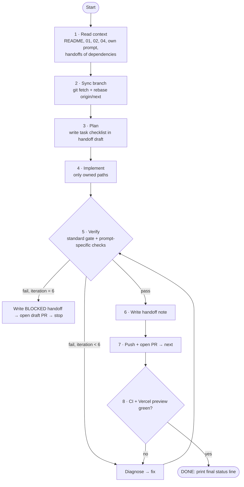

# 04 — Agent Loop Protocol

Every agent prompt in `prompts/` says to follow this protocol. It is written for autonomous agents running without a human in the loop.

## The loop



## 1. Read context (always)

1. `docs/plan/00-README.md`, `01-architecture.md`, `02-shared-contracts.md`, `04-agent-loop-protocol.md`
2. Your own prompt file
3. `docs/handoffs/*.md` for every agent listed in your **Depends on**
4. `docs/plan/03-deployment-flow.md` if you are 1.4, 3.3, 4.1 or 4.2

## 2. Branch & workspace

- Work in the worktree you were started in. Your branch is `agent/<id>-<slug>`.
- First command: `git fetch origin && git rebase origin/next`.
- Commit little and often with Conventional Commits, scoped by your id: `feat(2.3): experience timeline`.
- Never push to `next` or `main`. Never force-push anyone else's branch.

## 3. Standard verification gate (every agent, every iteration)

```bash
pnpm install --frozen-lockfile || pnpm install   # the second form only if you added deps
pnpm lint
pnpm typecheck
pnpm test -- --run
pnpm build                                        # must produce ./out
node scripts/verify-export.mjs                    # once 1.4 has merged; skip before
```

Then run the **Acceptance criteria** commands in your prompt. All of them must pass.

**Visual check (UI agents 1.1, 2.x):** run `pnpm dlx serve out -l 4173`, open your routes with Playwright at 375px and 1280px widths in both themes, and save the screenshots to `docs/handoffs/assets/<id>/`. Look at them yourself before declaring DONE.

## 4. Iteration budget and stop rules

| Condition | Action |
|---|---|
| All checks pass | Write handoff → PR → **DONE** |
| A check fails | Read the error, fix the root cause (never skip tests or add `@ts-ignore`/`eslint-disable` without a written reason), and loop again |
| 6 failed iterations on the same check | **BLOCKED**: open a *draft* PR, handoff explains the blocker and what you tried |
| You need to change a file you don't own | Don't. Add a **CCR** (see 02 §6) and work around it locally within your paths |
| A dependency's stub is still a stub | Build against the stub's props. Don't implement someone else's component |
| Information only the human has (URLs, copy, screenshots) | Use clearly marked placeholders (`TODO(owner): …`), list them in the handoff under **Needs human input** |

## 5. Handoff note — `docs/handoffs/<id>.md`

```md
# Handoff <id> — <title>
**Status:** DONE | BLOCKED
**Branch / PR:** agent/<id>-<slug> · #<pr>
**Vercel preview:** <url>

## What I built
- …

## Files touched
- path — why

## Decisions
- … (with the alternative rejected and why)

## How to verify
- commands / URLs / screenshots

## Needs human input
- [ ] …

## Contract Change Requests
- (none) | CCR-<id>-1 …

## Notes for downstream agents
- …
```

## 6. Pull request

- Title: `[<id>] <short title>`, base `next`.
- The body uses `.github/pull_request_template.md` (from 1.4 onward): summary, a link to the handoff, screenshots, and a checklist copied from your acceptance criteria.
- Wait for `ci` and the Vercel preview. If either fails, go back into the loop.

## 7. Final status line

The last line of the agent's output, so an orchestrator can parse it:

```
AGENT_RESULT id=<id> status=<DONE|BLOCKED> pr=<url> preview=<url> ccr=<count>
```

## 8. Wave gate (orchestrator or you)

1. Collect `AGENT_RESULT` lines. Every agent must be `DONE`.
2. Apply the accepted CCRs on `next` in one PR: `chore(gate-<wave>): apply CCRs`.
3. Merge the agent PRs. If a lockfile conflicts, rebase, take `next`'s lockfile, then `pnpm install`.
4. `next` is green → start the next wave from the new `origin/next`.
