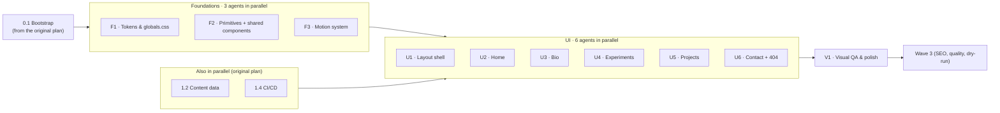

# Design Build — Foundations & UI

This folder turns the approved design (`reference/portfolio-design.pdf`, 11 screens) into code. It is the **authoritative source for anything visual**: tokens, components, page composition, and the visual QA that decides when a screen is done.

It supersedes parts of the original plan. Everything else in `docs/plan/` still applies.

| Original prompt | Status |
|---|---|
| `prompts/wave-0/0.1-bootstrap-repo.md` | **Still required.** Run it first. It creates the repo, contracts and stubs |
| `prompts/wave-1/1.1-design-system.md` | **Superseded** by `prompts/foundations/F1` + `F2` |
| `prompts/wave-1/1.3-motion-primitives.md` | **Superseded** by `prompts/foundations/F3` |
| `prompts/wave-1/1.2-content-data.md` | **Still required.** Runs alongside the foundations track |
| `prompts/wave-1/1.4-ci-cd-pipelines.md` | **Still required.** Runs alongside the foundations track |
| `prompts/wave-2/2.1` … `2.6` | **Superseded** by `prompts/ui/U1` … `U6` |
| `prompts/wave-3/*`, `prompts/wave-4/*` | **Still required**, unchanged, after `V1` |

The contracts in `docs/plan/02-shared-contracts.md` (types, `siteConfig`, stub prop signatures, ownership matrix) and the loop protocol in `docs/plan/04-agent-loop-protocol.md` are unchanged and every agent here follows them.

---

## The screens

| # | Reference | What it defines |
|---|---|---|
| 01 | `reference/01-foundations.png` | Brand colours, neutrals (dark + light), gradient, type scale, layout, motion budget, focus ring |
| 02 | `reference/02-components.png` | Buttons, badges, external link, project card, stat tile, nav item, form fields, filter chips, timeline node |
| 03 | `reference/03-home-desktop.png` | Home at 1280 |
| 04 | `reference/04-bio-desktop.png` | Bio at 1280 |
| 05 | `reference/05-experiments-desktop.png` | Experiments at 1280 |
| 06 | `reference/06-projects-index-desktop.png` | Projects index at 1280 |
| 07 | `reference/07-project-detail-desktop.png` | Project detail at 1280 |
| 08 | `reference/08-not-found-desktop.png` | 404 at 1280 |
| 09 | `reference/09-home-mobile.png` | Home at 390 |
| 10 | `reference/10-mobile-menu.png` | Mobile navigation sheet |
| 11 | `reference/11-contact-dialog.png` | Contact dialog |

---

## Documents

| File | What it is | Who reads it |
|---|---|---|
| [`00-STATE.md`](./00-STATE.md) | **Read first.** What is already merged on `next`, and the exact delta each foundations agent has to close — waves 0 and 1 shipped before the design was approved | every agent |
| [`01-design-tokens.md`](./01-design-tokens.md) | Every token with its exact value, the type scale, spacing, radii, elevation, gradients, motion and focus rules | F1 writes it, everyone consumes it |
| [`02-component-specs.md`](./02-component-specs.md) | Anatomy, variants, states, sizes and props for every component on screen 02 | F2 builds it, UI agents consume it |
| [`03-page-specs.md`](./03-page-specs.md) | Section-by-section composition of all six screens, desktop and mobile, with spacing and responsive rules | U1–U6 |
| [`04-visual-qa-protocol.md`](./04-visual-qa-protocol.md) | How an agent proves its screen matches the design: harness, checklist, thresholds | every agent, and V1 |

---

## Parallel execution



| Phase | Agents | Runs in parallel | Prompt |
|---|---|---|---|
| Foundations | F1 Tokens | with F2, F3, 1.2, 1.4 | [`prompts/foundations/F1-tokens-and-globals.md`](./prompts/foundations/F1-tokens-and-globals.md) |
| | F2 Primitives & shared | ″ | [`prompts/foundations/F2-primitives-and-shared.md`](./prompts/foundations/F2-primitives-and-shared.md) |
| | F3 Motion | ″ | [`prompts/foundations/F3-motion-system.md`](./prompts/foundations/F3-motion-system.md) |
| UI | U1 Layout shell | with U2–U6 | [`prompts/ui/U1-layout-shell.md`](./prompts/ui/U1-layout-shell.md) |
| | U2 Home | ″ | [`prompts/ui/U2-home.md`](./prompts/ui/U2-home.md) |
| | U3 Bio | ″ | [`prompts/ui/U3-bio.md`](./prompts/ui/U3-bio.md) |
| | U4 Experiments | ″ | [`prompts/ui/U4-experiments.md`](./prompts/ui/U4-experiments.md) |
| | U5 Projects | ″ | [`prompts/ui/U5-projects.md`](./prompts/ui/U5-projects.md) |
| | U6 Contact + 404 | ″ | [`prompts/ui/U6-contact-and-404.md`](./prompts/ui/U6-contact-and-404.md) |
| Integration | V1 Visual QA & polish | alone | [`prompts/integration/V1-visual-qa-and-polish.md`](./prompts/integration/V1-visual-qa-and-polish.md) |

### Why F2 and F3 can run beside F1

`01-design-tokens.md` already contains the final token names and values, so F2 and F3 write `bg-card`, `text-muted-foreground` and `--ease-brand` from day one. F1 is what makes those names resolve. The three agents touch different files (`globals.css` vs `components/ui` + `components/shared` vs `components/motion`) and merge cleanly.

### Why the UI phase waits for foundations

A UI agent styling against the 0.1 stubs would produce screenshots that can't be compared to the reference, so its visual QA would be meaningless. The gate is short: foundations agents are small and their PRs land quickly.

**If you want maximum overlap**, start U1–U6 early with `EARLY_START=1`: they build markup, structure and tests only, take no screenshots, and rebase onto `next` for the visual pass once foundations merge. Each UI prompt says exactly what that mode changes.

---

## Running it

`scripts/agents/wave.sh` does the worktree bookkeeping. One worktree and one branch
(`agent/<id>`) per agent, all branched off `origin/next`, so parallel agents never share a working
copy.

```bash
./scripts/agents/wave.sh plan   foundations   # show what would run, and where
./scripts/agents/wave.sh launch foundations   # create the worktrees and run F1, F2, F3 in parallel
./scripts/agents/wave.sh status foundations   # branch · PR · AGENT_RESULT per agent
```

Each agent prints `AGENT_RESULT id=<id> status=… pr=… preview=… ccr=…` as its last line; the script
collects those from `.agents/logs/<id>.log`. Then merge the three PRs into `next` (wave gate,
`docs/plan/04-agent-loop-protocol.md` §8), `./scripts/agents/wave.sh cleanup foundations`, and
repeat for the `ui` wave and then `integration`.

The declared waves are `foundations` (F1–F3), `ui` (U1–U6), `integration` (V1), `wave-3` and
`wave-4`. `BASE_BRANCH` and `AGENT_CMD` are overridable if you branch off something other than
`next` or drive a different agent runner.

---

## Definition of done for this folder

- [ ] All 11 reference screens are reproduced in code at 390px and 1280px, in dark and light
- [ ] Visual QA (`04-visual-qa-protocol.md`) passes for every screen: layout, type, colour, spacing, states
- [ ] No component hard-codes a colour, radius, shadow or duration — everything comes from tokens
- [ ] Light theme is complete, not an afterthought: every screen has been looked at in it
- [ ] Reduced motion and keyboard paths work on every interactive element
- [ ] Lighthouse and axe budgets from the original plan still pass
